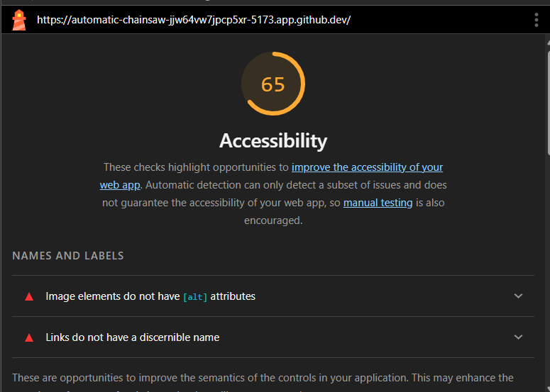
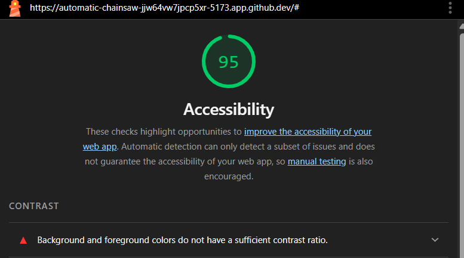
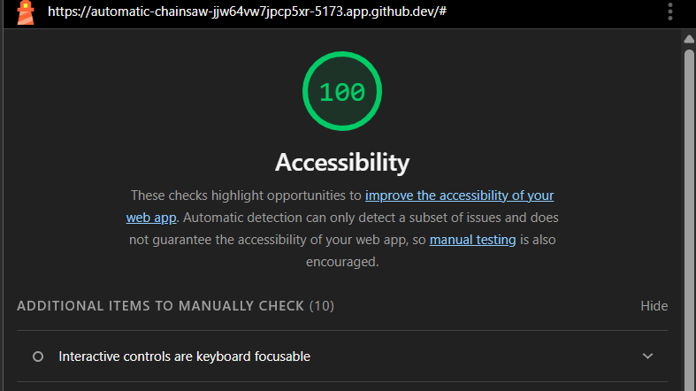

# Q1: Quels sont les arguments que vous pouvez utiliser pour convaincre votre Client de rendre son quizz accessible ? (Vous pouvez vous aider du cour)
Réponse:
Coté légal :
- En Europe, la directive européenne 2016/2102 impose l’accessibilité pour les services publics numériques.
- Les entreprises peuvent être exposées à des risques juridiques si leur service n’est pas accessible.

Coté social :
Rendre le site accessible permet d’inclure :
- personnes malvoyantes
- personnes utilisant un lecteur d’écran
- personnes ne pouvant utiliser une souris

Coté business
- Plus d’utilisateurs potentiels
- Meilleure image de marque
- Amélioration du SEO (Google favorise les sites accessibles)
- Argument technique
- Code plus propre
- Meilleure maintenabilité
- Meilleure qualité logicielle globale

# Q2: Ajouter le screen de votre score :
Screen:

# Q3: Est-ce que l'analyse de Lighthouse est suffisante pour évaluer l'Accessibilité de votre Application ?
Réponse:
Non car il repose sur des tests automatisés (Axe).
Il détecte seulement les problèmes techniques mesurables et les erreurs structurelles évidentes. Mais il ne peut pas détecter l'ergonomie clavier réelle, compréhension réelle avec lecteur d’écran ou l'analyse de la qualité du code 
# Q4: Combien de fois vous devez utiliser une touche du clavier pour passer le quizz ?
Réponse:
entre 24 et 30 fois
# Q5: Donner 3 roles ARIA et 3 propriété ARIA
Réponse:
roles :
role="navigation" : indique une zone de navigation.
role="button" : indique qu’un élément se comporte comme un bouton.
role="dialog" : indique une boîte de dialogue interactive.
propriétés :
aria-label : fournit un nom accessible à un élément.
aria-live : indique qu’un contenu peut être mis à jour dynamiquement.
aria-hidden : masque un élément aux technologies d’assistance.
# Q6: Ajouter le screen de votre score Lighthouse
Screen:

# Q7: L'une des best practice de l'ARIA est "ne pas utiliser l'ARIA" pouvez nous expliquer pourquoi d'après vous ?
Réponse:
Il faut utiliser HTML sémantique d’abord, et ARIA uniquement si nécessaire.
Les balises HTML ont déjà des rôles implicites
Une mauvaise utilisation d’ARIA peut dégrader l’accessibilité
# Q8: Ajouter le screen de votre score Lighthouse
Screen:

# Q9: Pourquoi le score de lighthouse n'a pas augmenté d'après vous ?
Réponse:
Le score Lighthouse n’a pas augmenté car :
-Les modifications apportées étaient principalement sémantiques et structurelles.
-Lighthouse mesure surtout des critères techniques détectables automatiquement.

# Q10: Quel est la valeur du rapport de contraste actuel :
Réponse:
contrast ratio : 2.36

# Q11: Quel est la valeur du score AA :
Réponse: 3.0

# Q12: Quel est la valeur du score AAA :
Réponse: 4.5

# Q13: Comment pouvez vous changer la valeur du contraste de votre texte ?
Réponse:
Modifier la couleur du texte (color), couleur du fond (background color), augmenter épaisseur police ou augmenter taille texte.

# Q14: Ajouter le screen de votre score Lighthouse
Screen:

# Q15: Êtes vous capable de déterminer visuellement ce qui est un lien ou pas en appliquant chaque altérations ?
Réponse:
Avec seulement la couleur non.
oui pour : icône ou changement au hover

# Q16: Ajouter le screen de votre score Lighthouse
Screen:

# Q17:  Proposition 1
Description:
Nb d'actions gagnée : 

# Q18:  Proposition 2
Description:
Nb d'actions gagnée : 

# Q19:  Proposition 3
Description:
Nb d'actions gagnée : 
